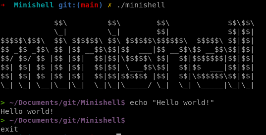

# minishell

| Project Name | minishell |
| :-: | :-: |
| Description | A custom implementation of bash based on the posix version |
| Technologies | <a href="#"></a> |
| External libraries | readline(), rl_clear_history(), rl_on_new_line(), rl_replace_line(), rl_redisplay(), add_history(), printf(), malloc(), free(), write(), access(), open(), read(), close(), fork(), wait(), waitpid(), wait3(), wait4(), signal(), sigaction(), sigemptyset(), sigaddset(), kill(), exit(), getcwd(), chdir(), stat(), lstat(), fstat(), unlink(), execve(), dup(), dup2(), pipe(), opendir(), readdir(), closedir(), strerror(), perror(), isatty(), ttyname(), ttyslot(), ioctl(), getenv(), tcsetattr(), tcgetattr(), tgetent(), tgetflag(), tgetnum(), tgetstr(), tgoto(), tputs() |
| Final grade | 125/125 |

## Image


## Usage
```
git clone https://github.com/robinbnc/minishell.git
cd minishell
make bonus
./minishell
```

## Tester
-> Please use our <a href="https://github.com/cberganz/minishell_tester">Minishell_tester</a> !
